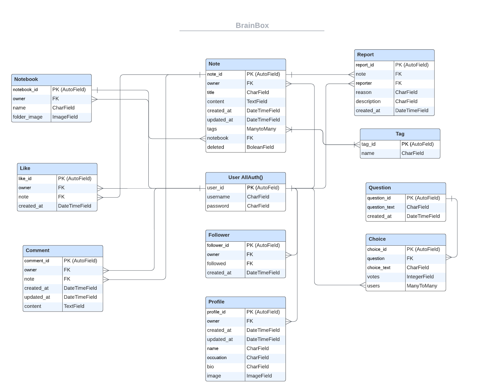

# BrainBox API

The BrainBox API, built on Django Rest Framework, serves as the backend for the BrainBox project, a note-taking web application. It forms the foundation of the BrainBox platform, empowering users to organize and manage their notes efficiently.

## Agile Methodology

I've adopted Agile methodology for project planning, utilizing GitHub Projects as the primary tool. Within the [project](https://github.com/users/elindalenback/projects/7), I've organized work into user stories. Each user story includes a title, description, acceptance criteria, and tags to prioritize features as "must-have", "should-have", and "could-have". The workflow progresses from "To Do" to "In Progress" while actively working on user stories and finally to "Done" upon completion.

### Comments

**User Story #1:**
As a user, I can comment on posts or content so that I can share my thoughts and engage with other users.

**Acceptance Criteria:**
- AC1: There should be an option to add a comment below a post or piece of content.
- AC2: Users should be able to view existing comments on a post.
- AC3: The application should allow users to edit and delete their own comments.
- AC4: Comments should display the commenter's username and timestamp.

### Followers

**User Story #2:**
As a user, I can follow other users so that I can stay updated with their activities and content.

**Acceptance Criteria:**
- AC1: There should be a 'Follow' button to follow user profiles.
- AC2: Users should be able to see content from their followed profiles.
- AC3: The application should allow users to unfollow others.

### Likes

**User Story #3:**
As a user, I can like notes or content so that I can show appreciation or agreement.

**Acceptance Criteria:**
- AC1: There should be a 'Like' button below each post or piece of content.
- AC2: The application should display the total number of likes for each post.
- AC3: Users should be able to unlike a post if they change their mind and the likes count should then remove that in the likes count.

### Notes

**User Story #4:**
As a user, I can create and edit notes so that I can jot down and manage my ideas or information.

**Acceptance Criteria:**
- AC1: There should be an option to create a new note.
- AC2: Users should be able to edit or delete their own notes.
- AC3: Notes should have a title, content, and date of creation.

### Polls

**User Story #5:**
As a user, I can create and participate in polls so that I can gather opinions or preferences.

**Acceptance Criteria:**
- AC1: There should be an option to create a new poll.
- AC2: Users should be able to vote on polls.
- AC3: The application should display poll results in real-time.

### Profiles

**User Story #6:**
As a user, I can view and edit my profile so that I can manage my personal information and settings.

**Acceptance Criteria:**
- AC1: There should be a 'Profile' section accessible from the main menu.
- AC2: Users should be able to edit their profile details and upload a profile picture.
- AC3: The application should display user profiles with relevant information.
- AC4: Users should be able to view other users' profiles.

### Tags

**User Story #7:**
As a user, I can tag posts or content so that I can easily search and categorize related content.

**Acceptance Criteria:**
- AC1: There should be an option to add tags when creating or editing a note.
- AC2: Users should be able to search for tag-related notes.
- AC3: The application should allow users to add multiple tags to a single note or content.

### Reports

**User Story #8:**
As a user, I can report notes or content to administrators, so that inappropriate or spam content can be managed effectively.

**Acceptance Criteria:**
- AC1: Users should have the option to report a note by selecting a reason from a predefined list (e.g., spam, inappropriate content, other) when viewing a note.
- AC2: The application should display a form for users to provide additional description or context when reporting a note.
- AC3: Upon reporting a note, the system should capture the reporting user's information and timestamp the report creation.
- AC4: Administrators should be able to view a list of reported notes, along with the reasons and descriptions provided by users.
- AC5: Administrators should have the ability to take appropriate actions (e.g., delete, hide) based on the reported notes and reasons provided.
- AC6: Users should receive feedback upon reporting a note, confirming that their report has been submitted successfully.

### Notebooks

**User Story #9:**
As a user, I can create and organize notebooks, so that I can manage my notes efficiently.

**Acceptance Criteria:**
- AC1: Users should have the ability to create a new notebook by providing a name for the notebook.
- AC2: Upon creation, each notebook should be associated with the user who created it.
- AC3: The application should allow users to upload a custom image for the notebook's folder, which will serve as its visual representation.
- AC4: If a custom image is not provided, the application should display a default image for the notebook's folder.
- AC5: Users should be able to view a list of their notebooks, along with their associated names and folder images, in the user interface.
- AC6: Users should have the ability to delete or edit their notebooks, including updating the name and folder image.
- AC7: The application should enforce data integrity by ensuring that each notebook has a unique name for each user.

## Features

1. **User Commenting**
   - Enable users to comment on posts or content.
   - Implement functionalities to add, view, edit, and delete comments.
   - Display commenter's username and timestamp for each comment.

2. **User Following**
   - Allow users to follow other users.
   - Enable users to view content from followed profiles.
   - Implement functionalities for users to unfollow others.

3. **Content Liking**
   - Enable users to like notes or content.
   - Show the total number of likes for each post.
   - Allow users to unlike a post and update the likes count accordingly.

4. **Note Management**
   - Enable users to create and edit notes.
   - Implement functionalities to add, edit, and delete notes.
   - Include fields for note title, content, and date of creation.

5. **Poll Creation and Participation**
   - Allow users to create and participate in polls.
   - Provide options to create new polls and vote on existing ones.
   - Display poll results in real-time.

6. **User Profile Management**
   - User Registration and Authentication: Allows users to create accounts, log in and log out to access personalized features.
   - Implement functionalities for users to edit profile details and upload profile pictures.

7. **Content Tagging**
   - Allow users to tag notes or content for categorization and searchability.
   - Implement options to add tags when creating or editing a note.
   - Enable users to search for tag-related notes.

8. **Content Reporting**
   - Allow users to report notes or content to administrators.
   - Provide predefined reasons for reporting (e.g., spam, inappropriate content).
   - Capture reporting user's information and timestamp the report creation.
   - Enable administrators to view reported notes and take appropriate actions.

### Future Features

9. **Notebook Creation and Organization (Future Feature)**
   - Introduce a feature for users to create and organize notebooks.
   - Enable users to create new notebooks, associate them with their accounts, and upload custom images for visual representation.
   - Provide functionalities to view, delete, and edit notebooks, ensuring data integrity.

## Database Design

The application utilizes a relational database structured around Django models. The relationships between these models are depicted in the Entity-Relationship Diagram (ERD):

- **Profile**: Represents user profiles containing additional information like display name, avatar, occupation, bio, and an image. Each profile is linked to a corresponding user account through a one-to-one relationship.

- **Notebook**: Stores information about notebooks created by users, including the notebook name and a folder image. Each notebook is associated with a user account through a foreign key relationship.

- **Note**: Represents user-generated notes with fields for title, content, creation date, and last update date. It includes a foreign key to the User model for ownership and a many-to-many relationship with the Tag model for categorization. Additionally, notes can optionally be linked to a notebook through a foreign key relationship.

- **Comment**: Manages comments on notes, linking back to the User who made the comment and the note being commented on.

- **Like**: Tracks user interactions such as liking notes. It's linked to both the User who liked the note and the note being liked.

- **Follower**: Manages user interactions for following other users. It establishes a relationship between the user who is following (owner) and the user who is being followed (followed). This model enables users to track relationships and stay updated on content from other users they follow.

- **Report**: Handles the reporting of content, whether it be notes. It's associated with the User who reported the note and the note being reported.

- **Tag**: Used for categorizing notes, featuring a simple model with just a name for each tag. It establishes a many-to-many relationship with the Note model.

## Testing

All endpoints underwent manual testing during the development phase by accessing the URLs directly. The API was rigorously evaluated through various request types (GET, POST, PUT, DELETE) both during development and in the production environment, as initiated from the Front End Application.

### Python Linter (PEP 8)

Only the files containing custom Python code were subjected to testing:

- In settings.py, five instances of the 'E501 line too long' error were identified. In these specific cases, it was deemed acceptable not to break the line.
- For all other files, the result was "All clear, no errors found".

